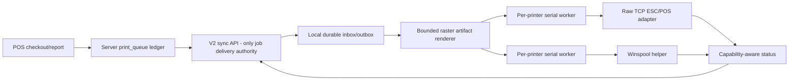

# POS Print Agent V2 - Long-Term Reliability Implementation Plan

**Date:** 2026-08-17
**Status:** Proposed and not executed
**Revision:** rev 2.1 — incorporates every correction from the adversarial review in
`docs/superpowers/evidence/2026-08-17-spooler-v2-plan-adversarial-review.md` (D1 agent-minted identity,
D2 single-instance lock, D3 cancellation channel, D4 enum-append migration constraint, named latency/load
tensions, optional owner-gated V1 triage, sent-state cancellation ownership, fail-closed instant ENUM DDL,
and a mixed 50-job release gate)
**Scope:** POS server print delivery, the installed Windows spooler, printer transport/status, long thermal reports, installer/updater continuity
**Supersedes:** Section 5 of `docs/superpowers/evidence/2026-08-17-spooler-lifecycle-review.md` and the transport decision in `docs/superpowers/plans/2026-07-05-spooler-professional-printing.md`
**Preserves:** Existing order/checkout behavior, `print_queue` history, idempotency keys, printer ownership, manual reprint audit, `spooler.env`, and the no-duplicate physical-print invariant

## Goal

Build one installed Windows print agent that remains useful for years:

- a server or Internet disconnect cannot erase accepted work (a restart during an outage preserves it
  **paused** until one sync revalidates identity — preserved, not printing blind);
- reconnecting automatically drains work within seconds without a service restart;
- delivery is pull-based: idle-case latency from enqueue to agent pickup is 0-2 s, stated openly instead of
  implying push;
- a process restart cannot silently duplicate a physical kitchen ticket;
- a long report cannot freeze unrelated printers or exhaust a low-end terminal;
- Windows printing uses the supported Winspool API instead of `copy /B`;
- printer health is reported honestly and in near real time where the device or driver supports it;
- cheap write-only printers remain supported without claiming knowledge they cannot provide;
- X/Z/items reports have a controlled hardware compatibility path instead of guessed fixes.

This is not a rewrite of the restaurant POS. It is a deepening of the installed spooler into a real local print agent.

## Chosen architecture



The critical distinction is:

- **one job channel:** short authenticated HTTP sync; V2 opens no Socket.IO connection;
- **one server ledger:** `print_queue`;
- **one local execution ledger:** atomic job files under ProgramData;
- **one stable claimant:** the installation agent ID, never a socket ID.

## Why not replace it with Print.js, QZ Tray, or PrintNode

- Print.js invokes browser printing for PDF/HTML/image content. It does not provide silent unattended raw ESC/POS, a durable local queue, printer status, or offline recovery.
- QZ Tray proves that raw printing and Winspool status are viable, but using it would add a second desktop runtime, signed-message/certificate operations, and licensing or private-root management while still leaving our cloud queue and restaurant-specific retry rules to us.
- PrintNode is a paid external cloud/client service. It is a valid product, but it would add per-customer dependency, cost, data routing, and outage ownership without removing the need for local hardware handling.
- Odoo IoT and Star CloudPRNT validate the selected boundary: an installed local hardware agent, outbound communication, durable jobs, and explicit device status.

The existing installed Node agent already occupies the correct architectural position. The plan fixes its boundaries instead of adding another bridge beside it.

## Non-negotiable invariants

1. Checkout queues printing asynchronously; it never waits for paper.
2. The server never deletes `print_queue` history.
3. The agent persists a job locally before telling the server it accepted ownership.
4. A `sent` lease may replay only to the same active agent until acceptance is resolved. Once the server records
   local acceptance, the job is never automatically reassigned; agent replacement terminalizes every unresolved
   old-agent row instead of transferring it.
5. The agent persists `transport_started` before the first network byte or before submitting a Winspool request.
6. After `transport_started`, a crash or timeout is `uncertain`; it is never automatically reprinted.
7. Safe transient failures retry locally with bounded backoff and do not become dead letters merely because a printer was offline for several attempts.
8. Permanent payload/configuration failures become terminal and visible; they do not loop forever.
9. Results remain in the local outbox until the server confirms settlement.
10. V2 delivery and recovery do not depend on Socket.IO state; the agent has one authenticated HTTP sync loop.
11. Work is serialized per physical printer, not globally across every printer.
12. "TCP port open", "Winspool accepted", and "paper printed" are different facts in the API and UI.
13. Unsupported printer-status protocols return `unknown`, never `ok`.
14. Every print artifact is bounded, hashed, and produced before transport.
15. Updates preserve `spooler.env`, agent identity, the local journal, diagnostic logs, and unsettled work.
16. Exactly one agent process may own a state root: workers start only after an exclusive state-root lock and
    one successful identity-validated sync. A second process against the same journal exits loudly; a restart
    during an Internet outage pauses accepted work visibly instead of printing on an unvalidated identity.
17. The agent mints its own identity: `agent_id` and secret are generated and durably persisted locally
    before the first server contact; the server stores only the token hash and never returns a secret.

## State models

### Server job state

```text
pending/failed
    -> processing     (short DB claim; safe to expire)
    -> sent           (response may have arrived; replay only to the same active agent)
    -> local_accepted (agent persisted it; no automatic reassignment)
    -> cancel_requested (agent must confirm before transport)
    -> acknowledged | failed | dead_letter | canceled
```

`failed` is reserved for safe server-visible retry. `dead_letter` covers permanent or uncertain outcomes. A deliberate manual reprint remains a new row with `reprint_of_queue_id`.

### Local job state

```text
received
    -> queued
    -> rendered
    -> transport_started
    -> completed

queued/rendered -> retry_wait -> queued       (safe transient failure)
queued/rendered -> permanent_failure           (bad payload/configuration)
queued/rendered -> canceled                    (durable pre-transport cancellation)
transport_started -> uncertain                 (manual decision required)
completed/permanent_failure/uncertain -> outbox_confirmed -> archived
```

Every arrow is an atomic local write. Restart recovery reads these files; it does not infer state from log text.

## Gate 0 - Freeze evidence before implementation

Do not alter raster commands based only on the old photograph.

Collect from the affected installation without copying customer data:

1. installed spooler version from `package.json` or release state;
2. exact printer make/model, Windows driver, port, print processor, and whether the configured path is Windows or direct TCP;
3. a sanitized current log covering one short receipt and one failed long report;
4. one controlled short mock report and one 200-row mock report printed with current 1.2.8;
5. the raw artifact hashes and command-band summary for both mock reports.

Decision:

- if 1.2.8 prints both correctly, the field defect was an old spooler/runtime and no extra raster profile is added;
- if short works and long fails, retain the height/payload hypothesis and test a conservative alternate raster profile;
- if both fail, investigate printer language/driver configuration before changing report rendering;
- if the same raw artifact works over direct TCP but fails through Windows, the Windows transport/driver path is the discriminator;
- if the same artifact fails through both paths, the printer command profile is the discriminator.

Record the result in the existing GitHub issue and `docs/deferred-spooler-long-report-raster-corruption.md`. This is the only honest way to close the hardware-specific report defect.

---

## Optional Task 0 - Owner-approved interim V1 fleet triage (server-only, one line, removable)

This task is **not part of the default V2 execution sequence**. Skip it unless the owner explicitly approves
this availability/ownership trade-off in the implementation turn.

The fielded 1.2.x spoolers keep their permanent kill switch until each station is migrated to V2. One
server-side change can keep a rejected fielded client polling instead of staying offline until a technician
restarts it, but the server cannot distinguish a stale incumbent from a genuine duplicate that shares the V1
identity. This is therefore an emergency fleet choice, not a correctness improvement.

**Files:**

- Modify: `server.js` (spooler connection handler, duplicate-registration branch)
- Modify: `backend/tests/integration/spoolerSocketTransport.test.js`

- [ ] **Step 1: Write the RED test** — a second socket for a live `spooler_id` is disconnected but receives
  **no** `spooler_rejected` event; a client running the fielded 1.2.x handler verbatim keeps its poll
  fallback enabled and continues printing over HTTP.
- [ ] **Step 2: Change** — delete the `socket.emit('spooler_rejected', { reason: registration.reason })` line;
  keep the `logger.warn` and the `socket.disconnect(true)`.
- [ ] **Step 3: Run** the focused spooler transport tests to GREEN.
- [ ] **Step 4: If explicitly approved, commit** as an independent, revertable commit. Remove it in the release that retires V1
  delivery (Task 5.2 step 7).

Effect on fielded clients: the rejected client sees `io server disconnect`, does not auto-reconnect, and its
poll fallback — which only `spooler_rejected` or HTTP 401/403 can disable — keeps printing at 3-5 s latency
until the service next restarts. Degraded-but-alive replaces permanently-dead. A genuine duplicate station is
still denied the socket but may also poll using the shared V1 credentials; the DB claim keeps one queue row
from being claimed twice, but work may split between two physical terminals. V1 has no safe server-only signal
that identifies which terminal should own the shared identity.

This knowingly accepts, **for V1 only and as triage**, the dual-path trade-off listed under rejected
shortcuts: the fielded client cannot be changed remotely, dual claim identities already exist in V1, and the
line disappears with V1 delivery itself.

---

## Task 1 - Add the V2 server protocol and durable agent identity

**Files:**

- Add: `backend/routes/spoolerV2.js`
- Add: `backend/services/spoolerAgents.js`
- Add: `backend/services/spoolerSync.js`
- Modify: `backend/services/printQueue.js`
- Modify: `backend/services/printDispatch.js`
- Modify: `backend/routes/admin/printQueue.js`
- Modify: `backend/services/printQueueWatchdog.js`
- Modify: `server.js`
- Add: `backend/tests/integration/spoolerV2Sync.test.js`
- Add: `backend/tests/integration/spoolerV2Compatibility.test.js`
- Add: `backend/tests/unit/spoolerAgentAuth.test.js`
- Add: the normal dated migration evidence SQL and, after explicit approval, its matching `.auto.sql`
- Modify after explicit approval: `backend/migrations/auto-manifest.json`
- Modify after explicit approval: `deployment/database/hostinger-manual-migrations.sql`
- Modify: `deployment/database/baseline.sql`
- Modify: `backend/tests/fixtures/seed.js`
- Modify: `backend/services/schemaValidation.js`
- Modify: `backend/tests/unit/schemaAuthority.test.js`
- Modify/add: focused admin-status and watchdog tests for the appended statuses

### 1.1 Write RED protocol tests

Prove all of these before implementation:

- the agent generates its `agent_id` and secret locally and persists the DPAPI blob **before** first server
  contact; registration presents only the SHA-256 token hash — the server never mints or returns a secret;
- registration is idempotent on `agent_id`: a committed registration whose response was lost is healed by the
  next authenticated sync, and a crash before registration leaves no server row (no ownerless-identity
  window can brick a station);
- the bootstrap key may register only when that station has no active agent, and a repeated bootstrap against
  an already-active station is rejected without side effects;
- another installation (a different `agent_id`) cannot silently replace the active agent;
- revocation/replacement is explicit and audited;
- a V2 request uses a per-installation secret and never logs it;
- the per-installation secret is protected with Windows DPAPI machine scope, so copying `agent.json` to another terminal does not clone authority;
- one sync can report prior accepts/results and receive new work;
- a lost sync response is replayed from that agent's existing unaccepted `sent` rows before any new row is claimed;
- two concurrent sync requests with capacity one return at most one distinct outstanding job in total;
- repeated acceptance is idempotent even after the job is already terminal;
- the claimant is `agent:<agent_id>` across process/network reconnects and HTTP requests;
- a result is idempotent when the local outbox sends it repeatedly;
- a payload is never returned to an agent that does not own its printer station;
- cancellation after a `sent` response may have reached the agent but before acceptance is reported stays
  outcome-ambiguous until the agent reports a terminal result;
- an expired `sent` row with no acceptance may be replayed only to the same active agent and is deduplicated by
  that agent's durable local journal;
- `local_accepted` is not automatically reclaimed;
- active V2 ownership disables V1 job delivery for that station without affecting other V1 stations;
- a V2 agent never opens Socket.IO and every job reaches it through sync;
- replacing an unreachable agent never feeds its unresolved rows to the replacement;
- forced replacement terminalizes the old agent's `cancel_requested` rows as outcome-unknown;
- a forced replacement cannot claim physical at-most-once unless the old installation is confirmed stopped.

### 1.2 Add the schema once

Use the normal migration evidence file, then the approved `.auto.sql`, manifest entry, and fallback parity required by `CLAUDE.md`.

Add `spooler_agents` with:

- agent-generated `agent_id` UUID primary key;
- logical `spooler_id`;
- SHA-256 token hash, never the token (the server never possesses or returns a plaintext secret);
- name/version/protocol version;
- active/revoked state and timestamps;
- last sync/last error/local queue depth/health summary;
- a generated unique active-station key so only one active agent owns a `spooler_id`.

Evolve `print_queue` with:

- `local_accepted` and `cancel_requested` in the status set;
- `agent_id` and `accepted_at`;
- structured `last_error_code` and `last_failure_class`;
- claim indexes that preserve current station/printer ownership.

Do not rewrite old rows. New columns are nullable and V1 behavior remains valid.

Enum safety on the never-delete queue: `print_queue` is never pruned (`baseline.sql:697-728`), so a status
enum change that inserts or reorders values can rebuild the hottest print table — inside a phpMyAdmin fallback
import with no online-DDL tooling, that is a production lock. `local_accepted` and `cancel_requested` must be
**appended after `canceled` at the end of the enum**, never inserted or reordered. The migration preflight
asserts the exact current enum value order, then runs the enum expansion as its own `ALTER TABLE` with explicit
`ALGORITHM=INSTANT, LOCK=NONE`. Never combine that statement with new columns, indexes, or foreign keys. If
the deployed MariaDB cannot perform the enum change instantly and without a lock, the migration must abort
before changing the schema; it must not fall back to `INPLACE` or `COPY`. Add columns and indexes in separate
statements with their own proven safe algorithms. The explicit status enumerations in
`backend/routes/admin/printQueue.js:15` and the print-queue health logger gain the new statuses in the same
phase that can first produce them.

### 1.3 Implement one `/api/spooler/v2/sync` lifecycle

The request contains:

```json
{
  "protocol_version": 2,
  "accepted": [{ "queue_id": 1, "payload_hash": "..." }],
  "results": [{
    "queue_id": 1,
    "outcome": "completed",
    "error_code": null,
    "failure_class": null,
    "device_status": "unknown",
    "duration_ms": 120,
    "artifact_hash": "..."
  }],
  "health": { "local_queue_depth": 0, "renderer": "ready", "helper": "ready" },
  "capacity": 1
}
```

The response contains confirmed accepts/results, every `cancel_requested` queue ID owned by this agent
(including a prior `sent` response whose acceptance remains unknown), at most the declared capacity of new
jobs, and a bounded next-sync hint.

Order inside one transaction:

1. lock and verify the active agent;
2. move verified accepted rows to `local_accepted`;
3. settle repeated results idempotently, including a result delivered in the same sync as its acceptance;
4. replay this agent's existing unaccepted `sent` rows;
5. subtract those rows from declared capacity, then claim only the remaining capacity for that agent's printer station;
6. commit;
7. return the response.

The active-agent row lock serializes concurrent sync requests. A retry returns the same outstanding rows; it does not accumulate another capacity-sized claim while the first response is in flight.

Cancellation flows through this same contract and nowhere else: the response lists `cancel_requested` rows;
the agent durably records the request, and answers through `results` with outcome `canceled` only when it
durably confirmed cancellation **before** `transport_started` — otherwise with the job's true outcome. On the
server, any terminal result settles a `cancel_requested` row, and only an agent-confirmed `canceled` outcome
may be presented to the operator as "paper prevented". This makes the local `queued/rendered -> canceled`
transition reachable for server-initiated cancels; without the response field that transition has no trigger.

A `sent` row is outcome-ambiguous as soon as its HTTP response may have reached the agent, even if the server
has not received the next acceptance sync. Therefore only `pending` work, or `processing` work proven not to
have been returned in a response, may cancel synchronously. Every `sent`, `local_accepted`, or already
`cancel_requested` row remains or becomes `cancel_requested` until the owning agent reports the true terminal
outcome. The server never labels those rows canceled merely because acceptance has not yet arrived.

No DB connection is held during network waits. There is no long-poll transaction.

### 1.4 Use one short HTTP sync loop

- V2 agents do not connect to Socket.IO or join the legacy `spoolers` room.
- Sync every two seconds while idle, with startup jitter; sync again immediately while the server returns work or the outbox has unsettled results.
- Network and 5xx failures back off at 2s, 5s, then 10s cap. Authentication/configuration failures remain visible and retry slowly; they never kill the service.
- A recovered network triggers an immediate sync.
- The server response may increase a healthy idle next-sync delay under load, but the agent clamps that hint to five seconds and the server cannot assign jobs through another path.
- Add an integration/load harness at 1, 10, 50, and 100 idle agents. Record request rate, DB connections, event-loop delay, and p95 sync latency. The expected idle rate is about 0.5 request/second per agent; do not accept a polling interval by intuition alone. Publish the DB-pool occupancy for the venue-realistic tier — one server, 1-5 agents — against the 10-connection pool and its 10-second acquire timeout; the 100-agent tier is evidence of headroom, not the acceptance bar.
- Assert in code and tests that the V2 package has no Socket.IO client lifecycle. V1 keeps its existing Socket.IO behavior during compatibility releases.

### 1.5 Make replacement honest

- Normal replacement first stops new intake and asks the old agent to drain or explicitly resolve every local job. It enters `decommissioned`, persists that state, stops workers, and confirms through sync only when no job is queued, rendering, transporting, uncertain, or awaiting result confirmation. Only then may the server activate the new agent.
- If the old agent is unreachable, the UI requires an explicit forced-replacement decision confirming that the old terminal/service is physically stopped or unavailable.
- In the replacement transaction, revoke the old agent and terminalize its `processing`, `sent`, `local_accepted`, and `cancel_requested` rows as recovery-required dead letters with `AGENT_REPLACED_OUTCOME_UNKNOWN`. Never reassign those rows automatically.
- A forced replacement is not advertised as proof of physical at-most-once: an offline old agent may already hold durable work. The operator must resolve each old row by audited manual reprint/cancel after confirming the old terminal cannot print it.
- A revoked/decommissioned agent that later starts must sync before starting workers, remain paused, and expose its local unsettled journal for recovery; it must not print it.

### 1.6 Verify and commit

Run the new focused tests plus existing print queue/ownership/reprint tests. Commit the server protocol and migration as one reviewable phase. Do not switch existing stations to V2 yet.

---

## Task 2 - Replace the memory queue with a durable local inbox/outbox

**Files:**

- Add: `pos-spooler-printer/lib/agent-identity.js`
- Add: `pos-spooler-printer/lib/job-journal.js`
- Add: `pos-spooler-printer/lib/sync-client.js`
- Add: `pos-spooler-printer/lib/job-engine.js`
- Add: `pos-spooler-printer/lib/print-errors.js`
- Modify: `pos-spooler-printer/server.js` into a composition root
- Add focused tests under `pos-spooler-printer/tests/`

### 2.1 Write the crash matrix as RED tests

Use a temporary state directory and kill/recreate the engine at each boundary. Identity bootstrap has its own
crash rows — it is the one handshake that can otherwise brick a station:

0a. before the locally generated identity blob is persisted — restart regenerates a fresh identity; no server
    row exists, so nothing is orphaned;
0b. after registration commits on the server but before the response/blob confirmation lands — the next sync
    authenticates with the already-persisted secret; no re-bootstrap occurs and no station is stranded;
0c. a second engine started against the same state root fails the exclusive lock, reports unhealthy, and
    exits without ever syncing or printing.

Job boundaries:

1. before a received job is persisted;
2. after persist but before acceptance sync;
3. after server acceptance but before render;
4. after artifact creation;
5. after `transport_started` but before adapter completion;
6. after completion but before result sync;
7. after result sync but before local cleanup.

Required results:

- cases 0a-0c leave no ownerless identity, no stranded station, and never a second running engine;
- cases 1-4 safely recover and print once;
- case 5 becomes uncertain and never auto-prints;
- cases 6-7 resend only the result, never the paper;
- corrupt or truncated journal files are quarantined and surfaced, not ignored;
- a duplicate server delivery resolves to the existing local record by queue ID plus idempotency key.

### 2.2 Persist one atomic file per job

Store under the existing ACL-protected ProgramData state root:

```text
jobs/active/<queue-id>-<idempotency-hash>.json
jobs/archive/
artifacts/
quarantine/
agent.json                (agent ID plus DPAPI machine-protected secret blob)
```

Each transition writes a temporary file, flushes it, atomically renames it, and only then mutates in-memory state. Do not rewrite one growing JSON object for every job.

Startup order is exclusive and identity-first:

1. acquire the exclusive state-root lock (a Windows named mutex through the platform adapter, or an
   `O_EXCL`-style lockfile with PID and liveness check); the loser reports unhealthy and exits without
   syncing — two engines over one journal is exactly how a machine still carrying both the legacy
   node-windows service and the NSSM service would double-print with a perfectly valid identity;
2. generate-or-load the agent identity and persist the DPAPI blob **before** the first server contact
   (invariant 17);
3. validate identity through one successful sync;
4. only then start workers.

Atomic per-file renames make individual writes safe; they do nothing about two processes running the same
journal. The lock is the boundary, not the rename.

The V2 agent token is never stored in plaintext or in `spooler.env`. Protect it with Windows DPAPI machine scope through a narrow platform adapter. Unit tests use a fake protector; one Windows integration test proves protect/unprotect under the service account, and a two-machine or VM installer gate proves that copied ciphertext cannot decrypt on a different machine. `LocalMachine` scope intentionally permits decryption by another account on the same machine, so the ProgramData ACL remains the same-machine access boundary. Updater rollback preserves the blob byte-for-byte. DPAPI machine scope plus that ACL prevents ordinary cross-machine file-copy cloning; it does not defend against a hostile local administrator or exact full-machine image cloning, which remain explicit recovery/security limits.

Migrate the current `seen-print-jobs.json` on first V2 start:

- completed entries become archived terminal records;
- `printing` entries become `uncertain`;
- keep the old file as a rollback backup;
- never convert uncertainty into a printable queued job.

### 2.3 Make local processing independent of cloud connectivity

- persist jobs received by sync;
- immediately report acceptance on the next sync;
- process already accepted local jobs during ordinary server/network interruption, except while startup identity validation is pending or the agent is paused/decommissioned;
- retain results until the server confirms them;
- restart the sync loop forever with bounded backoff; 401/403 enters a slow visible retry, not process suicide;
- a recovered network triggers an immediate sync, then falls back to the normal schedule.
- a runtime revoked/decommissioned response persists `paused` before any next transport; an already-started transport remains uncertain rather than being repeated;

### 2.4 Use structured failure classes

Replace message-prefix decisions with:

- `transient_safe`: printer unavailable, browser launch/crash, renderer infrastructure timeout, local disk pressure, or server unavailable before transport; kitchen/receipt work retries at 1s, 2s, then a 5s cap, while background reports cap at 30s;
- `permanent_safe`: invalid document contract, impossible routing, or unsupported printer configuration; terminal without physical ambiguity;
- `uncertain`: transport may have started; manual decision only.

Transient safe work stays durable until it succeeds, is canceled, or an authorized operator chooses a terminal action. Attempt count remains observable but is not a reason by itself to discard work.

### 2.5 Schedule per printer

- one serial execution lane per physical printer;
- one global render slot on low-resource machines;
- kitchen work has priority over reports that have not started rendering; an active report render is not preempted, so its deadline and memory cap are part of the kitchen latency bound — on the low-resource harness, measure and record the worst-case kitchen delay behind a non-preempted report render (deadline-class tens of seconds on a Celeron) and accept it explicitly in the canary, not by omission;
- different printers may transport concurrently after their artifacts exist;
- kitchen/receipt jobs preserve FIFO within their operational priority class; a not-started background report may be overtaken by operational work even on the same printer;
- kitchen jobs already waiting for a printer are not blocked by a report targeting another printer;
- capacity reported to the server equals actual free journal/worker capacity, not an arbitrary batch of 10 or 50.

Local storage is bounded without sacrificing recovery: delete artifacts and local records only after the server confirms a terminal outbox result, retain confirmed terminal archive metadata for the existing 14-day diagnostic window, and never age out active, retrying, uncertain, quarantined, or unconfirmed work. If a durable write/flush/rename fails, do not acknowledge or begin transport; report storage health and retry safely.

### 2.6 Verify and commit

Run the entire spooler unit suite plus the new crash matrix. Commit the local durable engine separately from transport changes.

---

## Task 3 - Bound rendering and replace shell printing with real adapters

**Files:**

- Add: `pos-spooler-printer/lib/render-engine.js`
- Add: `pos-spooler-printer/lib/artifact-store.js`
- Add: `pos-spooler-printer/lib/transports/network-escpos.js`
- Add: `pos-spooler-printer/lib/transports/windows-winspool.js`
- Add: `pos-spooler-printer/native/winprint/Program.cs`
- Add: `scripts/build-winprint-helper.ps1`
- Modify: `pos-spooler-printer/thermal-raster.js`
- Modify: `pos-spooler-printer/renderDocument.js`
- Modify: `pos-spooler-printer/report-html.js`
- Remove the `BufferConnector`, `copy /B`, and periodic `Get-Printer` process loop from `pos-spooler-printer/server.js`

### 3.1 Prove resource and transport boundaries RED

Tests must demonstrate:

- a 200-row report never creates a full-height screenshot, full-height RGBA canvas, or one growing `Buffer.concat` buffer;
- raster bands are ordered with no missing/duplicated rows;
- the artifact hash is stable for identical input;
- timeout closes the page/recycles Chromium and leaves no late transport;
- a hung Windows helper is killed and classified uncertain only if submission may have started;
- network connect failure is transient safe;
- network write failure after the marker is uncertain;
- one report cannot block a separate kitchen-printer transport lane;
- peak RSS and event-loop delay remain inside recorded budgets on the low-resource harness.

### 3.2 Produce bounded artifacts

- render the document in bounded vertical clips;
- convert one clip to thermal rows, write it to a temporary artifact stream, then release clip memory;
- append alert/cut commands exactly once;
- fsync and atomically publish the artifact;
- persist artifact byte length and SHA-256 before transport;
- stream the artifact to the adapter with backpressure.

Do not use `Promise.race` as cancellation. The render timeout must close the active page and recycle the browser before the job engine advances.

### 3.3 Add a tiny Winspool containment helper

Compile tracked C# source for .NET Framework 4.8, which is present on the installer-supported Windows 10 22H2/Windows 11 floor. The helper is spawned and supervised by the Node agent.

It exposes newline-delimited JSON operations:

- enumerate printers;
- submit a RAW artifact through `OpenPrinter -> StartDocPrinter -> WritePrinter -> EndDocPrinter`;
- return the Windows job ID and exact bytes written;
- report printer/job changes from Winspool notification APIs.

Winspool calls are synchronous and can hang. That is why they live in a killable child process. The Node agent applies a total deadline, kills/restarts the helper on expiry, and preserves uncertainty when submission may have begun.

Do not shell out to `copy`, `Get-Printer`, or `taskkill` per tick/job.

### 3.4 Harden direct TCP

- explicit connect, preflight, write-idle, and total deadlines;
- stream with backpressure;
- write the durable transport marker immediately before the first byte;
- use DLE EOT only for printers whose capability probe proved a valid response;
- serialize DLE EOT probes through the printer lane, skip them while transport is active, and bound them tightly so status bytes can never interleave with job bytes;
- a TCP connection alone means `reachable`, not `ok` or `printed`;
- unsupported/no-response printers remain write-only with status `unknown`.

### 3.5 Verify and commit

Use a fake TCP printer that can pause, close mid-stream, return valid/invalid DLE EOT, and count complete artifacts. Use a fake helper for deterministic tests and one Windows integration test against a test print queue. Commit rendering and adapters as one phase only after the resource/transport gate passes.

---

## Task 4 - Close report compatibility and expose honest real-time status

**Files:**

- Modify only if Gate 0 proves needed: raster profile validation/storage in printer settings and schema
- Modify: `backend/services/printerStatus.js`
- Modify: `backend/routes/admin/printQueue.js`
- Modify: `backend/routes/admin/printers.js`
- Modify: `src/admin/pages/Settings.vue`
- Modify: `src/admin/composables/useSystemStatus.js`
- Add focused backend/frontend tests

### 4.1 Make report rendering canonical

Move X/Z/items/daily report assembly behind the same renderer contract as receipts and kitchen tickets. `server.js` must not contain print-type HTML branches.

Keep one sanitized 200-row fixture that exercises:

- Arabic text shaping;
- every report section;
- thousands of raster rows;
- band boundaries;
- exactly one alert and one cut;
- both network and Windows artifacts producing identical bytes.

### 4.2 Add a compatibility profile only if Gate 0 demands it

Default remains the current tested `GS v 0` 256-row bands.

If the affected current-version printer still desynchronizes, add one evidence-selected alternative, not a catalog of guesses:

- smaller `GS v 0` bands; or
- 24-dot `ESC *` strips for older ESC/POS emulation.

Provide a controlled long compatibility test ticket and require a technician to confirm the paper result before saving a non-default profile. Never auto-detect by sending multiple unknown binary languages to a live kitchen printer.

### 4.3 Report capability-aware status

Expose separately:

- agent connectivity and last sync;
- local durable queue depth and oldest job;
- renderer/helper readiness;
- Windows spooler printer/job status;
- network reachability;
- printer-reported DLE EOT status where proven;
- last artifact submission and last acknowledged job.

UI wording must distinguish:

- `device_confirmed` - printer protocol reported a usable state;
- `os_accepted` - Windows accepted the job;
- `bytes_sent` - raw network write completed;
- `unknown` - no trustworthy feedback.

Never label `os_accepted` or `bytes_sent` as paper printed.

Cancellation uses the same boundary: only server-side `pending` work, or `processing` work proven not to have
left the server, may be canceled immediately. `sent`, `local_accepted`, and existing `cancel_requested` work
must remain `cancel_requested` until the agent durably confirms cancellation before `transport_started` or
reports the true terminal outcome. If the agent is offline or transport may have begun, the UI must show
pending/unknown rather than promise that paper was prevented.

### 4.4 Add support diagnostics without customer data

One admin action downloads a redacted bundle containing versions, station/agent IDs, printer driver/port/capability, queue state counts, timing summaries, recent error codes, artifact hashes/sizes, and service lifecycle timestamps. Exclude payloads, receipts, item/customer names, keys, tokens, and environment secrets.

### 4.5 Verify and commit

Run focused API/UI tests and a physical matrix:

- short receipt;
- kitchen ticket;
- 200-row X/Z/items report;
- Windows printer;
- direct TCP printer;
- paper out/cover open where hardware supports it;
- unsupported clone returning `unknown` without delaying every job.

The report issue remains open until the affected physical printer passes.

---

## Task 5 - Stage migration, updater continuity, and hostile release gates

**Files:**

- Modify: `deployment/windows/Install-Spooler.ps1`
- Modify: `deployment/windows/Update-Spooler.ps1`
- Modify: `deployment/windows/SpoolerLayerState.ps1`
- Modify: `deployment/tools/spooler-layer-manifest.js`
- Modify: `scripts/build-installers.ps1`
- Modify: installer/package contract tests
- Modify: `docs/architecture.json`, regenerate `docs/architecture.html`
- Modify: `docs/printing-runbook.md`

### 5.1 Preserve state and make cutover atomic

- package the compiled Winspool helper in the spooler application layer;
- preserve `spooler.env` byte-for-byte;
- preserve/migrate `agent.json`, active jobs, artifacts, outbox, archive, and logs;
- stop the service, verify/migrate journal, swap application files, start, and verify V2 sync;
- automatic rollback to V1 is allowed only before V2 accepts its first job;
- after any V2 local acceptance, rollback restores the last working V2 binary or leaves the station paused for recovery; it must not start V1 delivery against a V2 journal it cannot execute;
- never downgrade or rewrite a V2 journal containing unsettled jobs;
- no runtime transition unless Node/dependencies/Chromium actually changed.

### 5.2 Roll out without a fleet cliff

1. deploy server compatibility first; V1 remains unchanged;
2. enable V2 on a lab station with fake printers;
3. canary one real station while V1 rollback remains packaged;
4. test the affected long-report printer;
5. expand station by station;
6. make new installs default to V2 only after canary evidence;
7. retain V1 for two stable releases, then remove it in a separate reviewed change.

Switching a station to V2 is a durable server decision. The cutover first stops V1 intake and requires every V1 `processing`/`sent` row to settle or enter explicit outcome-unknown recovery. Only an empty V1 ownership boundary may activate V2. Activation additionally requires the installer's legacy-service sweep to have confirmed **exactly one** spooler service on that machine — a machine still carrying both the legacy node-windows daemon and the NSSM service must be cleaned before cutover, because a second same-identity process is the one clone the DPAPI boundary cannot see (the instance lock is the runtime backstop; the sweep is the install-time gate). It does not silently fall back to a simultaneous V1 agent, because that would reintroduce dual ownership.

### 5.3 Run the hostile release gate

Automate every scenario that does not require physical paper:

| Scenario | Required result |
|---|---|
| V2 package/runtime inspection | No Socket.IO client connection or alternate delivery path exists |
| 1/10/50/100 idle V2 agents | Measured sync load stays inside the documented server/DB budget |
| HTTP timeout/403/500/server restart | Local accepted jobs continue; sync recovers automatically |
| Lost successful sync response | Same unaccepted `sent` rows replay immediately; no lease wait and no new distinct claim |
| Two concurrent capacity-one syncs | At most one distinct outstanding row is returned across both responses |
| Agent restart before/after acceptance | Same durable job resumes once |
| Crash after transport marker | Uncertain, never auto-reprinted |
| ACK/result loss | Result resends, paper does not |
| Second installation uses the same station | Its distinct agent cannot claim or replace silently |
| Two V2 processes share one identity/journal on one machine | The exclusive state-root lock stops the second before it syncs or prints |
| Registration crashes at each identity boundary (0a/0b) | No ownerless state: pre-persist crash regenerates; post-commit response loss heals via authenticated sync; no station requires manual revocation to recover |
| Protected identity file copied to another Windows terminal | DPAPI unprotect fails; no sync or printing starts |
| Cancel requested while the job is locally queued | The agent learns it from the sync response, durably confirms, and reports outcome `canceled` pre-transport |
| Cancel after a `sent` response reaches the agent but before acceptance sync | Server records `cancel_requested`; it never claims paper was prevented until the agent proves pre-transport cancellation |
| Acceptance and completion reported in one sync | Server applies acceptance first, then settles the result idempotently |
| Replacement after accept ACK loss | Old unresolved rows become recovery-required; replacement never receives them |
| Forced replacement with an old `cancel_requested` row | The row becomes recovery-required with `AGENT_REPLACED_OUTCOME_UNKNOWN`; it is never reassigned automatically |
| Forced replacement while old terminal is unreachable | UI states outcome is unknown and requires old terminal shutdown plus audited resolution |
| Revoked old terminal starts later | It syncs before workers and remains paused; no old journal item prints |
| Runtime agent revocation | Paused state persists before another transport; any active transport is uncertain |
| Server lease expiry before acceptance is recorded | Replay only to the same active agent; its durable journal deduplicates a response that had actually arrived |
| Server lease expiry after local acceptance | No automatic reassignment |
| Windows helper hang | Child killed; main agent/status loop survives |
| Windows spooler service restart | Helper reconnects; jobs remain durable |
| Network printer offline then online | Safe retry prints after recovery |
| DLE EOT unsupported/garbage | Capability becomes unknown/write-only, not healthy |
| Status poll arrives during print | Probe is skipped/serialized; no bytes interleave with the artifact |
| 200-row report on low-end harness | Bounded memory/event-loop delay; no global printer stall |
| Report and kitchen target different printers | Kitchen lane is not blocked by report transport |
| Background report queued before kitchen on same printer | Kitchen overtakes only if report transport has not started |
| 50 mixed kitchen, receipt, and long-report jobs across multiple printers while one printer is offline then recovers | All 50 jobs remain durably accounted for with no duplicate or loss; other-printer kitchen work is not blocked by the report/offline lane, and the recovered printer drains within the bounded retry policy |
| Disk full/ACL failure at every journal transition | No premature accept/transport; work and health remain recoverable |
| Cancel before/after local acceptance and transport marker | Only proven pre-transport cancellation reports canceled; ambiguity stays visible |
| Updater interrupted at every phase | Old or new coherent install; env and jobs preserved |
| V2 updater rollback before first acceptance | V1 may resume coherently |
| V2 updater rollback after local acceptance | Working V2 is restored or station stays paused; V1 does not receive those jobs |
| V1 row is in flight during V2 cutover | Activation is blocked or row is explicitly terminalized as outcome-unknown; no dual delivery |
| V1 and V2 stations coexist | Each station receives through one protocol only |

Physical gates:

- affected customer long report;
- at least one Windows USB/shared printer;
- at least one direct TCP printer;
- one cheap write-only clone;
- paper-out/cover-open on one feedback-capable model.

### 5.4 Update architecture and commit

Update the map only after the implemented symbols and line numbers exist. Run architecture generation/check, the full spooler suite, focused backend protocol/queue tests, focused admin UI tests, installer contract tests, and `git diff --check`.

Commit this phase separately. Do not deploy, push, or rebuild customer installers without explicit authorization in that turn.

## Rejected shortcuts

- **Reconnect batch 10:** changes probability, not correctness; job capacity must come from the local journal.
- **Probe an old socket for 2.5 seconds:** a low-end blocked event loop can evict a live agent; durable installation ownership removes the race.
- **In-memory in-flight Set:** lost on process death; the local journal is the dedupe boundary.
- **A V2 wake-only Socket.IO connection:** it still creates a second lifecycle for a two-second latency optimization; the short HTTP sync loop is the only V2 channel.
- **Keep HTTP polling after duplicate rejection while WebSocket also delivers:** bypasses single-owner protection and preserves two claim identities.
- **`destroy()` to `end()` as a reliability fix:** loopback evidence did not prove truncation; explicit write/total deadlines and artifact accounting solve the real boundary.
- **More PowerShell timeouts:** contains one symptom but retains repeated heavy processes and no event-driven job identity.
- **Print.js:** browser dialog helper, not a POS print agent.
- **Automatic reprint after an uncertain transport:** impossible to make safe with dumb printers.
- **Claim paper printed from TCP/Winspool acceptance:** unsupported by the hardware evidence.

## Definition of done

The plan is complete only when:

1. the server has one pull-only delivery protocol and stable agent claimant for V2;
2. accepted work survives server, network, agent, and Windows helper restarts;
3. every crash point has an automated expected outcome;
4. no automatic path can print after an uncertain transport state;
5. reconnect recovery needs no technician/service restart;
6. long reports remain within measured low-end resource bounds;
7. real-time status is capability-aware and never overclaims;
8. the affected physical report printer passes or remains explicitly open with captured discriminating evidence;
9. updater interruption preserves env, identity, and unsettled work;
10. V1 removal is deferred until two stable V2 releases; if Optional Task 0 was explicitly approved and shipped,
    its triage line is removed with V1;
11. agent replacement cannot automatically reprint any row whose old-agent outcome is unknown;
12. a second process on the same machine cannot sync or print from the same identity/journal;
13. a registration crash at any boundary leaves the station able to recover without manual revocation;
14. the measured worst-case kitchen delay behind a non-preempted report render is recorded and accepted in
    the canary evidence;
15. the 50-job mixed-printer stress gate accounts for every job with no duplicate or loss and proves that an
    offline/recovering printer does not block kitchen work assigned to another printer.

## Primary technical references

- Print.js documentation: <https://printjs.crabbly.com/>
- QZ Tray raw printing/status/signing: <https://qz.io/docs/what-is-raw-printing>, <https://qz.io/docs/printer-status>, <https://qz.io/docs/signing>
- Odoo Windows Virtual IoT and POS printers: <https://www.odoo.com/documentation/19.0/applications/general/iot.html>, <https://www.odoo.com/documentation/19.0/applications/sales/point_of_sale/hardware_network/receipt_printers.html>
- Star CloudPRNT protocol: <https://star-m.jp/products/s_print/sdk/StarCloudPRNT/manual/en/protocol-reference/index.html>
- Microsoft raw Winspool flow and notifications: <https://learn.microsoft.com/en-us/windows/win32/printdocs/sending-data-directly-to-a-printer>, <https://learn.microsoft.com/en-us/windows/win32/printdocs/findfirstprinterchangenotification>
- Microsoft Windows DPAPI machine protection: <https://learn.microsoft.com/en-us/windows/win32/api/dpapi/nf-dpapi-cryptprotectdata>
- MariaDB instant ALTER behavior and fail-fast algorithm selection: <https://mariadb.com/docs/server/server-usage/storage-engines/innodb/innodb-online-ddl/innodb-online-ddl-operations-with-the-instant-alter-algorithm>
- Epson real-time ESC/POS status: <https://download4.epson.biz/sec_pubs/pos/reference_en/escpos/dle_eot.html>
